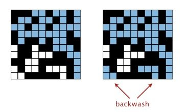
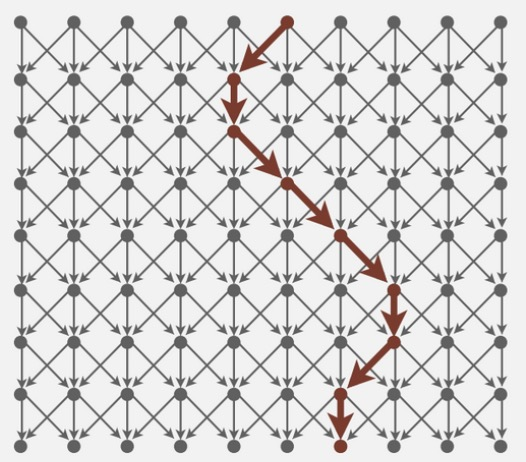

# Princeton-algs4

This repository contains my solution for the coursera course Algorithm I &amp; II

## Full AC tips with some bonus points

### [Hello, World](https://coursera.cs.princeton.edu/algs4/assignments/hello/specification.php)

Knuth’s method: when reading the ith word, select it with probability 1/i to be the champion, replacing the previous champion. After reading all of the words, print the surviving champion.

### [Percolation](https://coursera.cs.princeton.edu/algs4/assignments/percolation/specification.php)

How to deal with *backwash*: 

* Cause: We use two virtual sites to denote `top` and `bottom` respectively. When `top` and `bottom` is connected, those open sites that connected with `bottom` will also connect with `top`, just like left corner of the image.
* Solution: Use two union-find. One has two virtual sites, `top` and `bottom`, for *percolation* evaluation. Another has only one virtual site, `top`, for *full* evaluation.

### [Queues](https://coursera.cs.princeton.edu/algs4/assignments/queues/specification.php)

* Permutation Bonus: use only one Deque or RandomizedQueue object of maximum size at most k

>In the ideal world the probability of each string of making it to the output is K/N. Though we do not know N until the whole input stream is read. For large N and small K we certainly do not want to accumulate all N strings before choosing K of them. The method I used in my code is to fill the first K spots in the RandomizedQueue with the first K strings. Then Mth string in the input replaces (via dequeue/enqueue) one of the strings already in the RandomizedQueue with the probability K/M.

```Java
while (!StdIn.isEmpty()) {
    String s = StdIn.readString();
    cnt++;
    if (queue.size() == k) {
        if (StdRandom.bernoulli(1.0 * k / cnt)) {
            queue.dequeue();
            queue.enqueue(s);
        }
    }
    else
        queue.enqueue(s);
}
```

### [Collinear Points](https://coursera.cs.princeton.edu/algs4/assignments/collinear/specification.php)

* "Return a comparator" reference: <https://stackoverflow.com/questions/6478515/return-type-from-a-comparator>
* How to remove duplicates

> When sorting `points` array in slope order, make sure that it also remains natural order. Then, by only counting segments starts from the smallest point, we can remove duplicates.

lets say `p1, p2, p3, p4, p5` forms a segments in natural order. `p1` is the smallest, `p5` is the largest (natural order)

* When `p1` is slope anchor, `min` is `p1`, `max` is `p5`, add this segment.
* When `p2` is slope anchor, `min` is `p1` not `p2`, `max` is `p5`, discard this duplicates.

### [8-puzzle](https://coursera.cs.princeton.edu/algs4/assignments/8puzzle/specification.php)

* `equals` method: Private data is accessible by any instance of that class,
        even if one instance of class A is accessing the private members of another instance of A.
        It's important to remember that that access modifiers (private, protected, public)
        are controlling class access, not instance access.
* Caching the Hamming and Manhattan priorities: not only caching in `Board` class, but also caching in `Node` inner class.
* [A* search algorithm](https://en.wikipedia.org/wiki/A*_search_algorithm)

### [Kd-Trees](https://coursera.cs.princeton.edu/algs4/assignments/kdtree/specification.php)

* Key pruning strategy: **When performing nearest neighbor search, we organize the recursive method so that when there are two possible subtrees to go down, we always choose the subtree that is on the same side of the splitting line as the query point as the first subtree to explore.**
  * It is a crucial performance optimization because the points encountered while exploring the first subtree may enable pruning of the second subtree. For typical inputs, choosing the direction that goes toward the query point makes it more likely that we will encounter points close to the query point.

* Use a structure (inner class) or member variables to save minimum distance to reduce the # of calls of `distanceTo`.

### [WordNet](https://coursera.cs.princeton.edu/algs4/assignments/wordnet/specification.php)
* Effeciency bonus: instead of using lockstep BFS with two vertices, I simply run two BFS on two vertices seperately to calculate distance array.
  * use `-1` if unvisited to save visited array
  * during second BFS, if vertex `v` is visited, calculate `distA[v] + distB[v]` to maintain minimum length.

* check multi-roots: more than one vertices' outdegree is 0
* check DAG: use DFS to check cycle.

### [Seam Carving](https://coursera.cs.princeton.edu/algs4/assignments/seam/specification.php)
* Do NOT create actual Edge-Weighted Graph or compute topological order explicitly.
* Another angel of topological order: **Kahn's algorithm** basically looks for the nodes that do not have any incoming edges, or have indegree = 0, and then removes it's outgoing edges, making it's outdegree also equal to 0. Here's the algorithm step by step:

  1. Find a vertex that has indegree = 0 (no incoming edges)
  2. Remove all the edges from that vertex that go outward (make it's outdegree = 0, remove outgoing edges)
  3. Add that vertex to the array representing topological sorting of the graph
  4. Repeat till there are no more vertices left.

  So, given the graph below, the topological order can be *from Left to Right, from Top to bottom*
  
  
* Save a global `energy[][]` variable, compute each node at the first time and when update needed.
* Pass `Color` type to energy function, avoid redundant calls to the `get()` method in Picture
* The order in which you traverse 2D array can make a big difference
  * When using row-major order, 2D array should better be HxW (find vertical seam)
  * When using col-major order, 2D array should better be WxH (find horizontal seam)
* Creating Color objects can be a bottleneck. Each call to the get() method in Picture creates a new Color object. You can avoid this overhead by using the getRGB() method in Picture, which returns the color, encoded as a 32-bit int. The companion setRGB() method sets the color of a given pixel using a 32-bit int to encode the color.
* Other optimizing method <https://www.coursera.org/learn/algorithms-part2/discussions/forums/uA826bPrEeaElQ6tBsFbjg/threads/rUrNgruSEeia7Q78GYFOcA>
